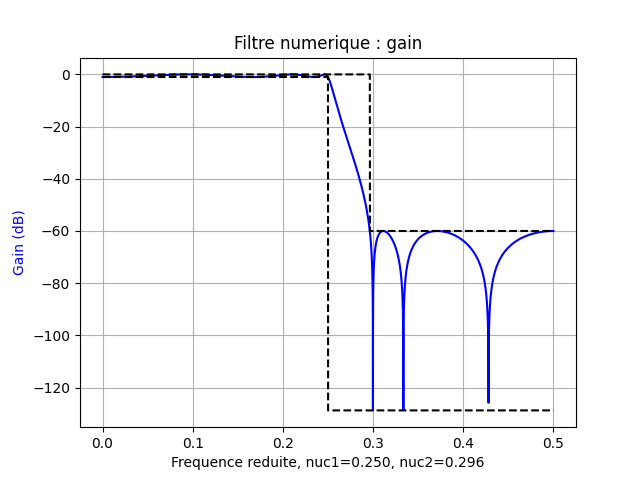
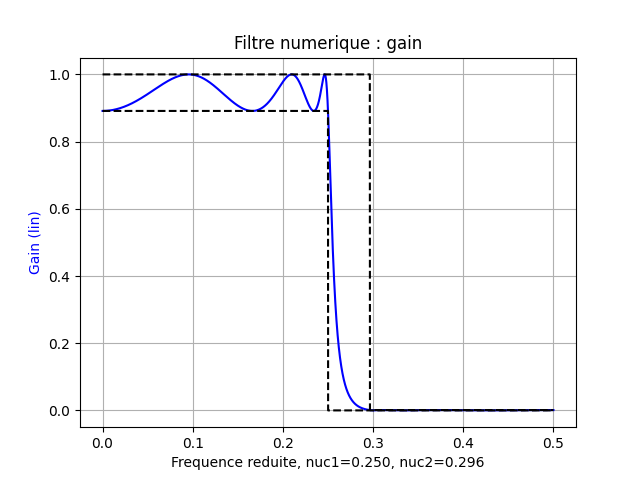
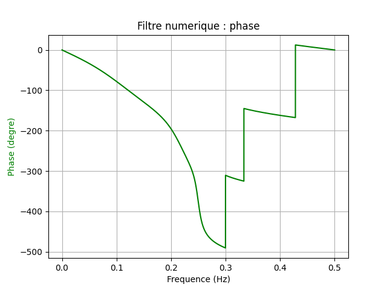
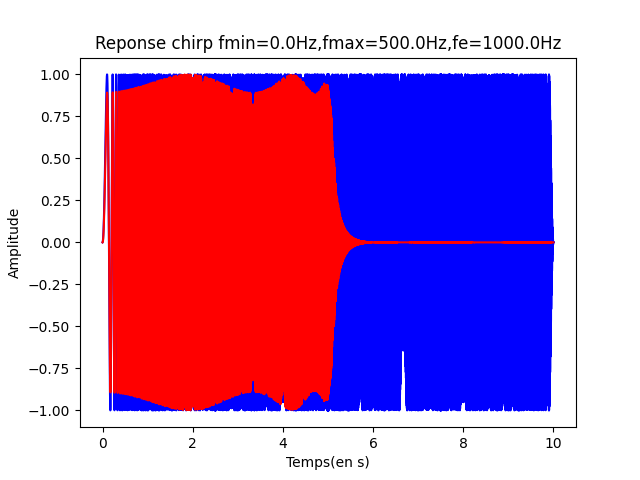
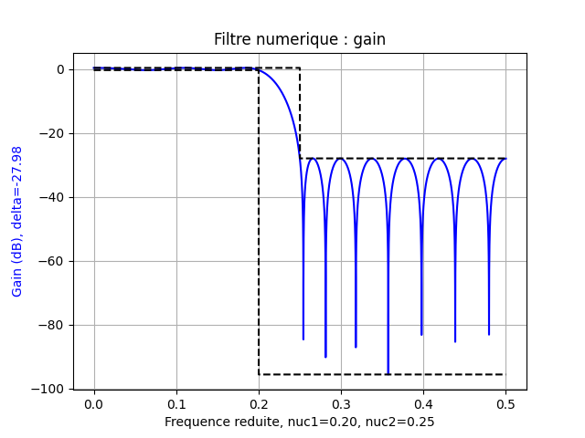
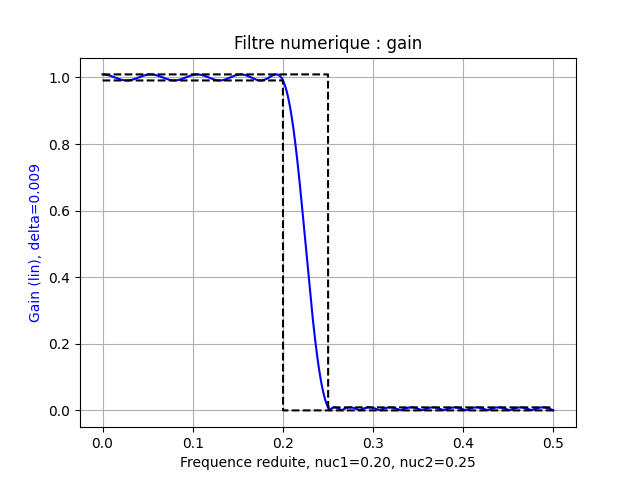
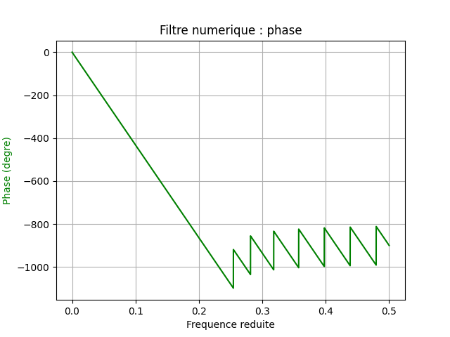
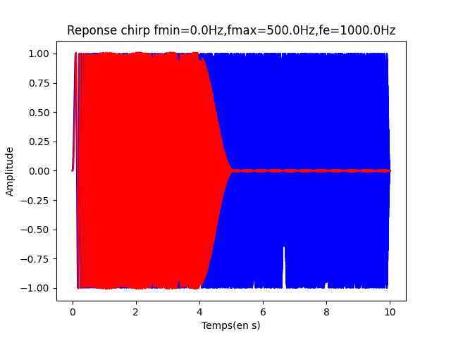

# Exemple de synthèse de filtres numériques

## Filtre RII (réponse impulsionnelle infinie)

Les méthodes de synthèse de filtres numériques à réponse impulsionnelle infinie s'inspirent
directement de celles appliquées pour les filtres analogiques. On y fait notamment
appel à la
[transformation bilinéaire](https://github.com/jeanluccollette/transformee-bilineaire)
pour transposer le gabarit du filtre numérique en celui d'un filtre analogique.

On accède alors aux coefficients de la fonction de transfert du filtre qui est une fraction rationnelle.

$$H(z)=\dfrac{\sum_{m=0}^{M}b_mz^{-m}}{1+\sum_{k=1}^{K}a_kz^{-k}}=\dfrac{Y(z)}{X(z)}$$

Le programme [rii.py](code/rii.py) donne un exemple de synthèse, avec une réponse en fréquence
donnée en fréquence réduite. On peut multiplier ensuite cette fréquence réduite par la fréquence
d'échantillonnage $f_e$ pour accéder à une fréquence exprimée en Hertz.

Le programme [rii_test.py](code/rii_test.py) permet ensuite de tester le filtre avec
un signal "chirp" dont la fréquence évolue linéairement au cours du temps entre $0$ et $\dfrac{f_e}{2}$.

## Filtre RIF (réponse impulsionnelle finie)

